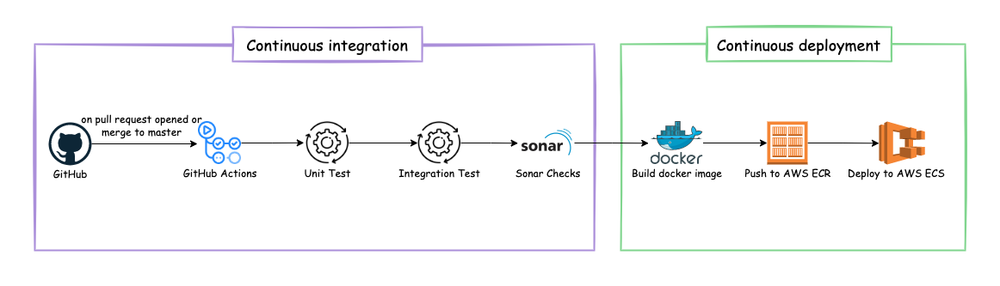

## Overview

The following diagram shows CI/CD processes.

## Continuous integration

Chronos continuous integration pipeline consists of 3 main steps:

1. Run unit tests
2. Run integration tests
3. Run sonarqube checks

These steps are triggered in two cases:

- Pull request opened
- Merge feature to the master

## Continuous deployment

Chronos continuous deployment pipeline consists of 3 main steps:

1. Build docker image
2. Publish docker image to the AWS ECR
3. Deploy docker image to the AWS ECS

## Links

- [Continuous Integration and Continuous Deployment ADR](../architecture-decisions/adr002-ci-cd.md)